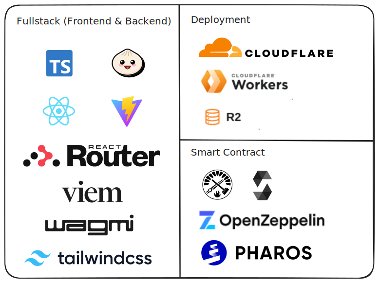

# Sokushuu Launchpad

Deployed Contract on Pharos Devnet [0x0973f46b0C8A5C8cb71DA32D5932C4824b94fa88](https://pharosscan.xyz/address/0x0973f46b0C8A5C8cb71DA32D5932C4824b94fa88)

Deployed App [https://launchpad.sokushuu.de](https://launchpad.sokushuu.de/)

## What is Sokushuu? A brief explanation

Sokushuu is an EduFi ecosystem rather than a single application. We are on a mission to help people without capital to learn comfortably while earning passively or leisurely through selling study materials, arts, and many more.


We will keep making a lot of studying tools and platforms, while aslo making more app that make user possible to earn in their mean time.

gshuu🎴

## Sokushuu Launchpad - Project Overview

Sokushuu Launchpad is one of Sokushuu Ecosystem that enable user to make NFT token through AI prompt, and then sell, send it, or even collect it. Launchpad is a tool that help user so they could easily create NFT contract and NFT token without even knowing what are they.

Why AI? Instead of being an enemy of AI, we want to collaborate with AI. In this Launchpad, AI is used to generate an image. But in our roadmap, we could ask AI to:

- make a different angle of a single photo
- help student to make an illustration for their task or presentation
- making a flashcard illustrations
- make a meme
- ask AI to make variants based on a single image
- ask AI to make variants based on NFT Collection


and many more.

## Why Pharos Chain?


Pharos is a new Chain. When we were developing this launchpad, Pharos were still in Devnet. Being early means a lot to us, including the strong support and relationship with fellow builders and with the Pharos team as well. Pharos also have a short finality. For some apps, short finality help making sure user doesn't wait too long. Short / fast finality is not for launchpad, but making a launchpad in this chain is making user more happy with the result.

There might be many launchpad as well, but what makes us different is our goal to help user who want to learn and doesn't have a capital. 

## Technology Stack



## Contracts Overview

### NFTLauncher
The `NFTLauncher` contract is responsible for creating and managing individual NFT tokens. It implements the ERC721 standard, allowing users to mint, transfer, and interact with NFTs. Key functionalities include:
- **Minting NFTs**: Allows users to mint new NFTs under the contract.
- **Base URI Management**: Facilitates the storage and retrieval of metadata associated with the NFTs.

### NFTLaunchManager
The `NFTLaunchManager` contract acts as a centralized manager for the NFT deployment process. It enables users to create new NFT contracts efficiently by utilizing the cloning process defined by EIP-1167. Its key features include:
- **Deploying Clone Contracts**: Uses the `Clones` library to deploy minimal proxies of the `NFTLauncher` contract, allowing efficient and cost-effective deployment of multiple NFT contracts.
- **Token Management**: Maintains a record of all deployed NFT contracts and manages user interactions, including the buying and selling of tokens.
- **Event Emission**: Emits events for actions such as deploying new NFTs and facilitating transactions to enhance transparency and traceability.

These contracts work together to provide a complete solution for users to create and manage NFTs with ease and efficiency.

## Application Overview

The Sokushuu Launchpad application serves as a user-friendly interface for creating and managing NFTs based on the Sokushuu ecosystem. Through this app, users can:

- **Create NFTs**: Generate unique NFT tokens powered by AI prompts, making it easier for users without technical expertise to enter the NFT market.
- **Manage Tokens**: View, send, and sell their NFTs seamlessly, leveraging the underlying blockchain technology for secure transactions.
- **Engage with Smart Contracts**: Interact with the `NFTLauncher` and `NFTLaunchManager` smart contracts to facilitate the deployment of new NFT contracts and manage NFT ownership.
- **User-Friendly Interface**: Enjoy an intuitive user experience that simplifies the complexities of blockchain interactions, encouraging broader participation in the NFT space.

The application is designed to democratize access to NFT creation and foster a creative ecosystem where anyone can mint and trade their digital art and assets.


## Installation

This project utilizes [Bun](https://bun.sh), a fast all-in-one JavaScript runtime. To install the necessary dependencies, run:

```bash
bun install
```

## Usage

To run the application, execute:

```bash
bun run app:dev
```

This will start the development server, and your application will be available at `http://localhost:5173`.

## Directory Structure

The project follows a structured directory layout:

```
sokushuu-launchpad/
│
├── packages/
│   ├── app/                     # Frontend application code (React)
│   └── smartcontract/           # Smart contracts and scripts
│
├── package.json                 # Project metadata and dependencies
└── README.md                    # Project documentation
```

## Contribution Guide

To contribute to this project, please follow these steps:

1. Browse existing issues on GitHub or open a new one if you have a suggestion.
2. Comment on the issue you're interested in; we will assign you to it.
3. Create a pull request (PR) with your changes, which will be reviewed by the team.

We welcome contributions and appreciate your interest in improving the Sokushuu Launchpad!

## References

- Icons by [lucide](https://lucide.dev/icons/)
- Fonts by [Excalidraw](https://plus.excalidraw.com/excalifont)